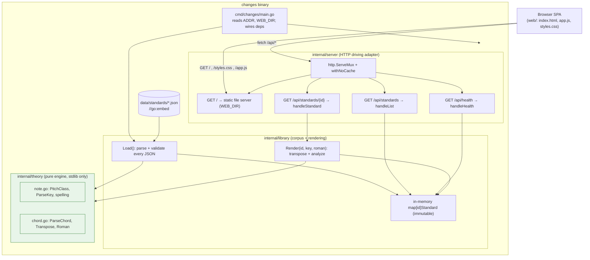

# Architecture

`changes` is a small Go web service that serves a searchable database of
jazz-standard chord progressions. Given a tune it renders the changes as a
lead-sheet grid, transposes them to any of the 12 keys, and optionally annotates
each chord with its Roman-numeral degree. See [`../AGENTS.md`](../AGENTS.md) for
the contributor-facing summary and [`../README.md`](../README.md) for how to run
it.

## Purpose & context

The corpus is a hand-curated seed of common lead-sheet changes (Blue Bossa, Bb
Jazz Blues, So What, Autumn Leaves, Take the A Train, and a handful more),
designed to scale toward the top ~100 standards. Each tune is a JSON file that
records its `source`. The "hard" part is not storage — the corpus is read-only
static data — but the music theory: parsing chord symbols, transposing them
correctly for the target key's spelling, and deriving Roman numerals. That logic
is isolated in a pure, stdlib-only engine and heavily unit-tested; everything
else (HTTP, the browser UI) is a thin shell around it.

Design consequence: there are **no storage adapters and no database**. The
corpus is embedded into the binary at build time via `//go:embed`, validated once
at startup, and held immutably in memory.

## Components & data flow

The dependency direction is strictly one-way: `server → library → theory`.
`theory` imports nothing outside the standard library; `library` never imports
`server`. These rules are not just convention — they are **enforced by
`depguard`** in [`../.golangci.yml`](../.golangci.yml) (see
[Key design decisions](#key-design-decisions)).

## Runtime flow

### Startup (`cmd/changes/main.go`)

1. Read `ADDR` (default `:8080`) and `WEB_DIR` (default `web`) from the
   environment.
2. `library.Default()` → `library.Load(embedded, "data/standards")`: read every
   `*.json` under the embedded corpus, unmarshal it into a `Standard`, and
   **validate** it — `theory.ParseKey` on the key and `theory.ParseChord` on
   every chord symbol in every bar. Malformed data (or a duplicate `id`) fails
   here, at startup, not at request time.
3. Standards are stored in an `map[id]Standard` plus an `order` slice sorted by
   title. The `Library` is immutable after `Load`.
4. `server.New(lib, webDir)` builds the handler; `http.ListenAndServe` starts
   serving.

### Request: `GET /api/standards/{id}?key=Eb&roman=1`

This is the core path. The Go 1.22+ pattern-based `ServeMux` routes it to
`handleStandard`:

1. Extract `id` (path value), `key` (query, empty = original key), and `roman`
   (truthy = `1|true|yes|on`).
2. Call `lib.Render(id, targetKey, withRoman)`:
   - Look up the `Standard` by `id`.
   - `theory.ParseKey(std.Key)` → original tonic; `theory.ParseKey(targetKey)` →
     target tonic. `semitones = target.Tonic - orig.Tonic`.
   - For every chord symbol in every bar of every section:
     `theory.ParseChord(sym)` → `chord.Transpose(semitones, target)` → spell the
     result with `StringIn(target)` (the target key decides sharp vs. flat
     spelling). When `withRoman` is set, also compute `chord.Roman(target)`.
   - Return a `Rendered` tree (sections → bars → `{symbol, roman}`).
3. On error, the handler distinguishes causes: an unknown `id` is a **404**; a
   valid `id` with a bad `?key=` is a **400**.
4. `writeJSON` encodes the `Rendered` payload as JSON.

The other routes are trivial: `handleList` returns the title-sorted `[]Summary`;
`handleHealth` returns `200 {status, standards}` as a liveness/readiness probe;
`GET /` serves `index.html`, and any other path falls through to the static file
server rooted at `WEB_DIR`. All responses carry `Cache-Control: no-store` via the
`withNoCache` wrapper.

### The frontend

`web/` is a dependency-free vanilla-JS SPA with **no build step**. `app.js`
fetches `/api/standards` to populate the tune picker, then calls
`/api/standards/{id}?key=…&roman=…` on every change and renders the returned grid
into the DOM. All music decisions (spelling, transposition, analysis) happen
server-side; the browser is a dumb renderer.

## The theory engine (why it exists)

`internal/theory` is pitch-class math, not string munging:

- **`PitchClass`** is a value in `[0,12)`. Transposition is modular addition;
  spelling is a lookup into `sharpNames`/`flatNames`, chosen per key.
- **`ParseKey`** handles accidentals and a trailing `m`/`min` (minor), and
  decides flat-vs-sharp spelling from the key signature convention (e.g. F major
  and D/G/C/F minor take flats).
- **`ParseChord`** splits a symbol into root, verbatim suffix, and optional
  slash-bass (`Bb7/D`). **Transposition shifts the root and bass but carries the
  suffix through unchanged** — correct for every quality/extension and faithful
  to the source's notation.
- **`Roman`** gives degree-and-quality analysis (`ii7`, `V7`, `Imaj7`, `iiø7`),
  casing the numeral by chord quality. It is literal, not yet full functional
  analysis (no secondary-dominant labeling like `V7/ii`). A key invariant,
  enforced by `TestRomanIsKeyRelative`, is that analysis is
  **transposition-invariant**: the same progression yields the same numerals in
  every key.

## External integrations & dependencies

- **Zero third-party Go dependencies.** [`../go.mod`](../go.mod) declares only
  `module changes` and `go 1.25` — no `require` block. The whole service is
  standard library.
- **Build/runtime tooling:** `golangci-lint` (v2) for linting, `air` (optional)
  for hot reload in `make dev`, Docker Buildx for multi-arch images, and `gh` for
  listing published image tags. These are developer tools, not runtime deps.
- **No external services at runtime** — no DB, cache, or upstream API. The only
  inputs are the embedded corpus and two environment variables.

## Key design decisions

- **Embed the corpus, validate at load.** The corpus is static, so it ships
  inside the binary (`//go:embed data/standards/*.json`) and is fully validated
  at startup. Adding a standard = dropping a validated JSON file in
  `internal/library/data/standards/` — the embed glob picks it up with no code
  change.
- **A pure theory core.** The bug-prone music logic is stdlib-only and knows
  nothing about HTTP, JSON, or the corpus, which makes it exhaustively
  unit-testable in isolation.
- **Layering enforced by lint, not just docs.** `depguard` in
  [`../.golangci.yml`](../.golangci.yml) forbids `theory` from importing
  `library` or `server`, and forbids `library` from importing `server`. The
  compiler + linter are the guard; there is no separate architecture-lint tool
  (the package graph is a simple three-layer stack, not a ports/adapters split
  that would warrant one).
- **Suffix-preserving transposition.** Only the root/bass pitch classes move;
  the quality suffix is verbatim. This is both correct and keeps display faithful
  to the source lead sheet.
- **Std-lib routing.** Go 1.22+ method+pattern `ServeMux` (`GET /api/…/{id}`)
  removes any need for a router dependency.

## Deployment

- **Image:** built and pushed to **`ghcr.io/gjcourt/changes`** by
  `make image` → [`../scripts/build_and_push_image.sh`](../scripts/build_and_push_image.sh),
  multi-arch (`linux/amd64,linux/arm64`) via Docker Buildx. Tags are date-based
  (`YYYY-MM-DD`, with a `-vN` suffix if the day's tag already exists). The
  [`../Dockerfile`](../Dockerfile) is a two-stage build (Go builder → `alpine`),
  runs as non-root `65534:65534`, copies `web/` to `/web`, sets `WEB_DIR=/web`,
  and exposes `8080`.
- **Homelab:** deployed to the Kubernetes cluster at
  **`changes.burntbytes.com`**. The manifests live in the `homelab` repo at
  `apps/base/changes/` (Deployment, Service, NetworkPolicy, PDB, ServiceAccount,
  GHCR pull secret) with the route in `apps/production/changes/httproute.yaml`.
  The image tag is pinned in `apps/base/changes/deployment.yaml`
  (`ghcr.io/gjcourt/changes:2026-06-25` at time of writing); bump that pin to
  roll out a new build.
- **CI:** [`../.github/workflows/ci.yml`](../.github/workflows/ci.yml) runs
  `golangci-lint` and `make test` (race detector) on every branch push and PR.
